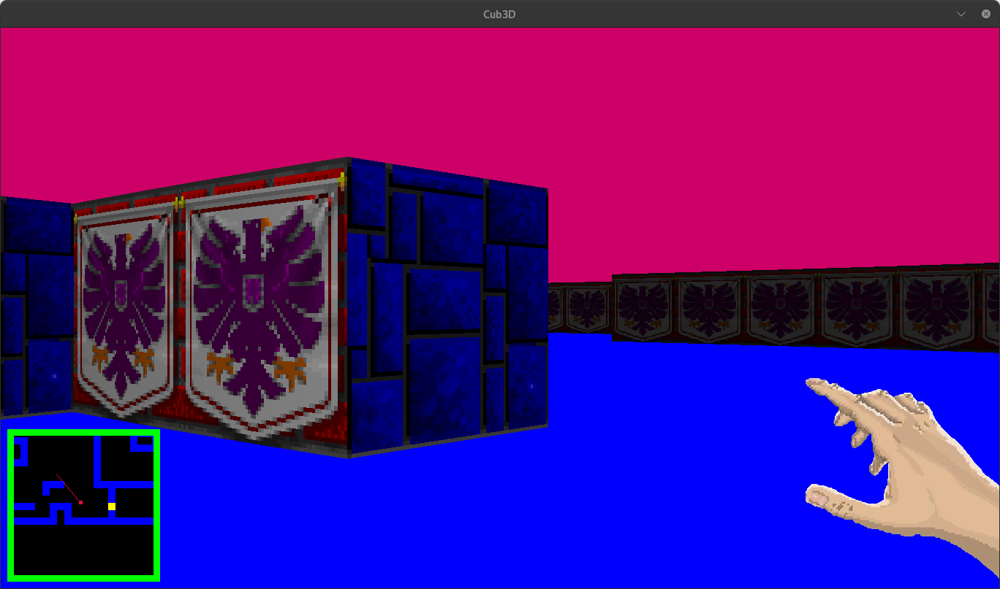
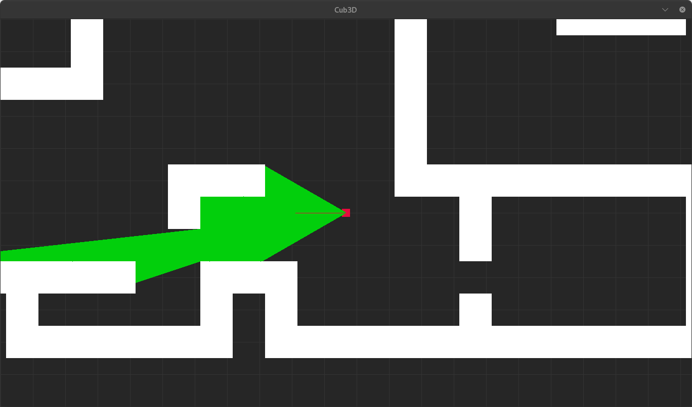

# Cub3D  
**A minimalist raycasting engine using minilibx-linux**  

---
**top 2D view**

---

## 🚀 Features  
- Raycasting engine with texture-mapped walls (N/S/E/W)  
- Smooth player movement (W/A/S/D) and camera rotation (←/→)  
- Configurable maps (`.cub` files) with collision detection  
- Bonus: Minimap, mouse controls, and door system  
- Full error handling for map validation and texture loading  

---

## 🔧 Installation  

### Dependencies  
```bash  
sudo apt install gcc make xorg libxext-dev libbsd-dev  # X11 libraries for minilibx  
```

1. **Clone repositories**:  
get the minilibx lib from here: https://github.com/42paris/minilibx-linux 
```bash  
git clone https://github.com/Imrane-Halim/Cub3d && cd cub3D  
```

2. **Build project**:  
```bash  
make        # Mandatory and bonus
make debug  # Top 2D view of the game
```

---

## 🕹️ Usage  
**Run with a map file**:  
```bash  
./cub3D maps/map.cub  
```

### Makefile Targets  
| Command       | Action                             |  
|---------------|------------------------------------|  
| `make`        | Build mandatory version            |  
| `make clean`  | Remove object files                |  
| `make fclean` | Full clean (objects + executable)  |  
| `make re`     | Rebuild from scratch               |  
| `make debug`  | Top 2D view rendering              |  

---

## 📐 Raycasting Implementation  
### Core Logic (`cast_ray.c`)  
1. **Grid Checks**:  
   - `find_horizontal_hit()`: Steps through Y-axis grid lines using `tan(angle)`  
   - `find_vertical_hit()`: Steps through X-axis grid lines using `1/tan(angle)`  

2. **Wall Detection**:  
   - Uses `obj_hit()` to check map cells (`0`=empty, `1`=wall, `D`=door)  
   - Returns closest intersection (vertical/horizontal) for distance calculation  

3. **3D Projection**:  
   - Converts ray distance to wall height:  
     `wall_height = (TILESIZE * screen_height) / distance`  
   - Applies textures based on wall orientation (N/S/E/W)  

---

## 🗺️ Map Configuration (`.cub` file)  
**Required elements**:  
```text  
NO textures/north.xpm  # North texture path  
SO textures/south.xpm  # South texture path  
WE textures/west.xpm   # West texture path  
EA textures/east.xpm   # East texture path  
F R,G,B                # Floor color (RGB)  
C R,G,B                # Ceiling color (RGB)  
```  

**Map rules**:  
- Use `0` (space), `1` (wall), `D` (door), and `N/S/E/W` (player spawn)  
- Must be surrounded by walls  
- Example:  
```  
        11111111111
        10000000001
1111111110000000001
1000000000000000001111111111
1000000000000000000000000001
1000000000000000000000000001    1111
1000000000111111110000000001    1N01
10000000001      10000000001    1111
10000001111      10000000001
1000000000111111110000000001
1000000000000000000000000001
1000000000000000000000000001
1111111100000000000011100001111111111
       111000000000010000000010000001
       100000000000000000000010000001
11111111000001111110011100000D0000001
1000000D000001 1000001 10000010000001
11111111111111 1111111 11111111111111
```  

---

## 🎮 Controls  
| Key           | Action                 |  
|---------------|------------------------|  
| `W/A/S/D`     | Move                   |
| `SPACE`       | Open and close doors   |
| `←`/`→`       | Rotate camera          |  
| `ESC`         | Quit game              |  
| `Mouse`       | Camera rotation (bonus)|  


🛠️ **Credits**  
- Raycasting logic inspired by [Permadi's tutorial](https://permadi.com/1996/05/ray-casting-tutorial-table-of-contents/)  
- [minilibx-linux](https://github.com/42paris/minilibx-linux) for graphics  
